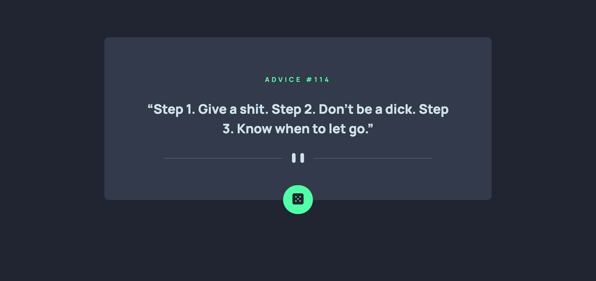

# Frontend Mentor - Advice generator app solution

This is a solution to the [Advice generator app challenge on Frontend Mentor](https://www.frontendmentor.io/challenges/advice-generator-app-QdUG-13db). Frontend Mentor challenges help you improve your coding skills by building realistic projects.

## Table of contents

- [Overview](#overview)
  - [The challenge](#the-challenge)
  - [Screenshot](#screenshot)
  - [Links](#links)
- [My process](#my-process)
  - [Built with](#built-with)
  - [What I learned](#what-i-learned)
  - [Continued development](#continued-development)
  - [Useful resources](#useful-resources)
- [Author](#author)

## Overview

### The challenge

Users should be able to:

- View the optimal layout for the app depending on their device's screen size
- See hover states for all interactive elements on the page
- Generate a new piece of advice by clicking the dice icon

### Screenshot



### Links

- Solution URL: [Add solution URL here](https://github.com/sajia-h/advice-generator.git)
- Live Site URL: [Add live site URL here](https://sajia-h.github.io/advice-generator/)

## My process

### Built with

- Semantic HTML5 markup
- CSS custom properties
- Flexbox
- Mobile-first workflow

### What I learned

The code below helped me see what the stream of data looked like, which returned a Javascript object. The object has the property slip. And slip is also an object. slip has the properties: id and advice. So I knew I needed contents of the advice property. And this could be simply accessed using dot-notation or bracket-notation:

 eg. data.slip.advice or data["slip"]["advice"]

```js
/* Fetch API */
fetch("https://api.adviceslip.com/advice");
```
I learnt how to fetch resources using the Fetch API. This led to knowing how to make an HTTP request and communicate with a web server. I understand the concept of 'Promise' now - so the response of a fetch is a Javascript Promise. This promise needs to be resolved, another way to say that the task needs to be fulfilled/finished. In this case, the HTTP response needs to successfully parse to JSON to access the content of the JSON file and finally, display the advice. 

### Continued development

Overall, I want to understand APIs more and ways to obtain data other than Fetch API as well as how to manipulate and store data. I would also like to look more into JSON and JS Objects and consolidate my knowledge about them. 

### Useful resources

- [Simple API guide](https://javascript.plainenglish.io/4-simple-steps-to-get-started-with-the-fetch-api-2f3aafaca17d) - This was a simple breakdown of APIs, JSON and JS Objects. I'd recommend it to anyone still learning this concept.

## Author

- Website - [Sajia](Coming soon)
- Frontend Mentor - [@sajia-h](https://www.frontendmentor.io/profile/sajia-h)

